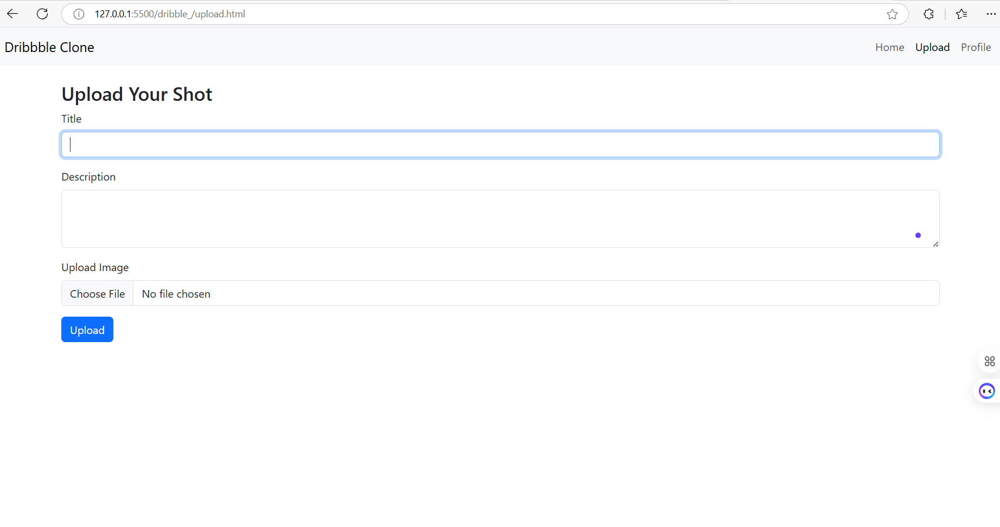
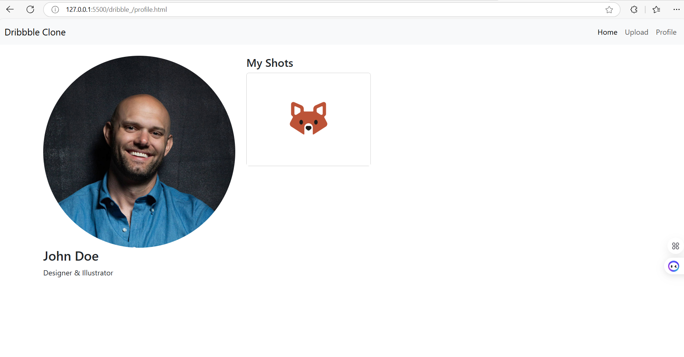

# Project Responsive Web Design using Bootstrap
# Date: 07/12/24
# AIM:
To create a simplified clone of Dribbble (https://dribbble.com/) landing page.

# DESIGN STEPS:
## Step 1:
Clone the repository from GitHub.

## Step 2:
Create Django Admin project.

## Step 3:
Create a New App under the Django Admin project.

## Step 4:
Insert the necessary CSS and JavaScript files as external in order to use Bootstrap.

## Step 5:
Create a HTML file and include the needed Bootstrap components.

## Step 6:
Publish the website in the LocalHost.

# PROGRAM :

# index.html

    <!DOCTYPE html>
    <html lang="en">
    <head>
      <meta charset="UTF-8">
      <meta name="viewport" content="width=device-width, initial-scale=1.0">
      <title>Dribbble Clone</title>
      <link href="https://cdn.jsdelivr.net/npm/bootstrap@5.3.0-alpha1/dist/css/bootstrap.min.css" rel="stylesheet" />
      <link href="assets/styles/style.css" rel="stylesheet" />
    </head>
    <body>
      <!-- Navbar -->
      <nav class="navbar navbar-expand-lg navbar-light bg-light">
        

          <a class="navbar-brand" href="#">
             <!-- Add your logo -->
          </a>
          <button class="navbar-toggler" type="button" data-bs-toggle="collapse" data-bs-target="#navbarNav" aria-controls="navbarNav" aria-expanded="false" aria-label="Toggle navigation">
            
          </button>
          

            <ul class="navbar-nav ms-auto">
              <li class="nav-item">
                <a class="nav-link active" href="index.html">Home</a>
              </li>
              <li class="nav-item">
                <a class="nav-link" href="upload.html">Upload</a>
              </li>
              <li class="nav-item">
                <a class="nav-link" href="profile.html">Profile</a>
              </li>
              <li class="nav-item dropdown">
                <a class="nav-link dropdown-toggle" href="#" id="exploreDropdown" role="button" data-bs-toggle="dropdown" aria-expanded="false">
                  Explore
                </a>
                <ul class="dropdown-menu" aria-labelledby="exploreDropdown">
                  <li><a class="dropdown-item" href="designers.html">Designers</a></li>
                  <li><a class="dropdown-item" href="teams.html">Teams</a></li>
                  <li><a class="dropdown-item" href="projects.html">Projects</a></li>
                </ul>
              </li>
              <li class="nav-item">
                <a class="nav-link" href="find-jobs.html">Find Jobs</a>
              </li>
              <li class="nav-item">
                <a class="nav-link" href="blog.html">Blog</a>
              </li>
            </ul>
          

        

      </nav>
    
      <!-- Search Bar -->
      

        <input type="text" class="form-control" id="searchInput" placeholder="Search shots..." onkeyup="filterShots()" />
      

    
      <!-- Main Content -->
      

        

          <!-- Shots will be dynamically injected here -->
        

      

    
      
      
    </body>
    </html>

# upload.html

    <!DOCTYPE html>
    <html lang="en">
    <head>
    <meta charset="UTF-8">
    <meta name="viewport" content="width=device-width, initial-scale=1.0">
    <title>Upload Shot - Dribbble Clone</title>
    <link href="https://cdn.jsdelivr.net/npm/bootstrap@5.3.0-alpha1/dist/css/bootstrap.min.css" rel="stylesheet" />
    <link href="assets/styles/style.css" rel="stylesheet" />
    </head>
    <body>
    <!-- Navbar -->
    <nav class="navbar navbar-expand-lg navbar-light bg-light">
        

        <a class="navbar-brand" href="#">Dribbble Clone</a>
        <button class="navbar-toggler" type="button" data-bs-toggle="collapse" data-bs-target="#navbarNav" aria-controls="navbarNav" aria-expanded="false" aria-label="Toggle navigation">
            
        </button>
        

            <ul class="navbar-nav ms-auto">
            <li class="nav-item">
                <a class="nav-link" href="index.html">Home</a>
            </li>
            <li class="nav-item">
                <a class="nav-link active" href="upload.html">Upload</a>
            </li>
            <li class="nav-item">
                <a class="nav-link" href="profile.html">Profile</a>
            </li>
            </ul>
        

        

    </nav>

    <!-- Upload Form -->
    

        <h3>Upload Your Shot</h3>
        <form id="uploadForm">
        

            <label for="shotTitle" class="form-label">Title</label>
            <input type="text" class="form-control" id="shotTitle" required>
        

        

            <label for="shotDescription" class="form-label">Description</label>
            <textarea class="form-control" id="shotDescription" rows="3" required></textarea>
        

        

            <label for="shotImage" class="form-label">Upload Image</label>
            <input class="form-control" type="file" id="shotImage" required>
        

        <button type="submit" class="btn btn-primary">Upload</button>
        </form>
    

    
    
    </body>
    </html>

# profile.html

    <!DOCTYPE html>
    <html lang="en">
    <head>
    <meta charset="UTF-8">
    <meta name="viewport" content="width=device-width, initial-scale=1.0">
    <title>Profile - Dribbble Clone</title>
    <link href="https://cdn.jsdelivr.net/npm/bootstrap@5.3.0-alpha1/dist/css/bootstrap.min.css" rel="stylesheet" />
    <link href="assets/styles/style.css" rel="stylesheet" />
    </head>
    <body>
    <!-- Navbar -->
    <nav class="navbar navbar-expand-lg navbar-light bg-light">
        

        <a class="navbar-brand" href="#">Dribbble Clone</a>
        <button class="navbar-toggler" type="button" data-bs-toggle="collapse" data-bs-target="#navbarNav" aria-controls="navbarNav" aria-expanded="false" aria-label="Toggle navigation">
            
        </button>
        

            <ul class="navbar-nav ms-auto">
            <li class="nav-item">
                <a class="nav-link active" href="index.html">Home</a>
            </li>
            <li class="nav-item">
                <a class="nav-link" href="upload.html">Upload</a>
            </li>
            <li class="nav-item">
                <a class="nav-link" href="profile.html">Profile</a>
            </li>
            </ul>
        

        

    </nav>

    <!-- Profile Content -->
    

        

        

            
            <h3>John Doe</h3>
            
Designer & Illustrator

        

        

            <h4>My Shots</h4>
            

            

                

                
                

            

            <!-- Repeat for other shots -->
            

        

        

    

    
    </body>
    </html>

# style.css

    .card-body {
    position: relative;
    }

    .card-text {
    height: 60px;
    overflow: hidden;
    }

    button {
    width: 100%;
    }

    #searchInput {
    width: 100%;
    max-width: 500px;
    margin: 0 auto;
    }

    .card {
    margin-bottom: 20px;
    }

# main.js

    // Simulating some shots data
    const shots = [
    {
        id: 1,
        title: 'Shot Title 1',
        description: 'A beautiful shot created by a designer.',
        imageUrl: 'assests/images/image1.png',
        likes: 0,
        comments: ['Great design!', 'Amazing work!'],
    },
    {
        id: 2,
        title: 'Shot Title 2',
        description: 'An innovative illustration made by a talented artist.',
        imageUrl: 'assests/images/image2.png',
        likes: 0,
        comments: ['I love the colors!', 'So creative!'],
    },
    {
        id: 3,
        title: 'Shot Title 3',
        description: 'A minimalistic design showcasing elegance.',
        imageUrl: 'assests/images/image3.png',
        likes: 0,
        comments: ['Beautiful simplicity!', 'Love this!'],
    },
    ];

    // Dynamically render shots
    function renderShots() {
    const container = document.getElementById('shotContainer');
    container.innerHTML = ''; // Clear current content

    shots.forEach((shot) => {
        const shotCard = document.createElement('div');
        shotCard.classList.add('col-md-4');
        shotCard.innerHTML = `
        

            
            

            <h5 class="card-title">${shot.title}</h5>
            
${shot.description}

            <button class="btn btn-primary" onclick="likeShot(${shot.id})">Like (${shot.likes})</button>
            <button class="btn btn-secondary" data-bs-toggle="collapse" data-bs-target="#comments-${shot.id}">Comments</button>
            

                <ul class="list-group mt-3">
                ${shot.comments
                    .map((comment) => `<li class="list-group-item">${comment}</li>`)
                    .join('')}
                </ul>
            

            

                <input type="text" class="form-control" id="commentInput-${shot.id}" placeholder="Add a comment" />
                <button class="btn btn-info mt-2" onclick="addComment(${shot.id})">Add Comment</button>
            

            

        

        `;
        container.appendChild(shotCard);
    });
    }

    // Like functionality
    function likeShot(shotId) {
    const shot = shots.find((shot) => shot.id === shotId);
    if (shot) {
        shot.likes += 1; // Increase the like count
        renderShots(); // Re-render shots to update the like count
    }
    }

    // Add a new comment
    function addComment(shotId) {
    const commentInput = document.getElementById(`commentInput-${shotId}`);
    const comment = commentInput.value.trim();
    if (comment) {
        const shot = shots.find((shot) => shot.id === shotId);
        if (shot) {
        shot.comments.push(comment); // Add comment to the shot
        renderShots(); // Re-render shots to update the comments
        commentInput.value = ''; // Clear the input field
        }
    }
    }

    // Search and filter shots
    function filterShots() {
    const searchQuery = document.getElementById('searchInput').value.toLowerCase();
    const filteredShots = shots.filter((shot) =>
        shot.title.toLowerCase().includes(searchQuery) ||
        shot.description.toLowerCase().includes(searchQuery)
    );
    renderFilteredShots(filteredShots);
    }

    // Render filtered shots
    function renderFilteredShots(filteredShots) {
    const container = document.getElementById('shotContainer');
    container.innerHTML = ''; // Clear current content

    filteredShots.forEach((shot) => {
        const shotCard = document.createElement('div');
        shotCard.classList.add('col-md-4');
        shotCard.innerHTML = `
        

            
            

            <h5 class="card-title">${shot.title}</h5>
            
${shot.description}

            <button class="btn btn-primary" onclick="likeShot(${shot.id})">Like (${shot.likes})</button>
            <button class="btn btn-secondary" data-bs-toggle="collapse" data-bs-target="#comments-${shot.id}">Comments</button>
            

                <ul class="list-group mt-3">
                ${shot.comments
                    .map((comment) => `<li class="list-group-item">${comment}</li>`)
                    .join('')}
                </ul>
            

            

                <input type="text" class="form-control" id="commentInput-${shot.id}" placeholder="Add a comment" />
                <button class="btn btn-info mt-2" onclick="addComment(${shot.id})">Add Comment</button>
            

            

        

        `;
        container.appendChild(shotCard);
    });
    }

    // Initial rendering of shots
    renderShots();

# OUTPUT:

# RESULT:
The Project for responsive web design using Bootstrap is completed successfully.
